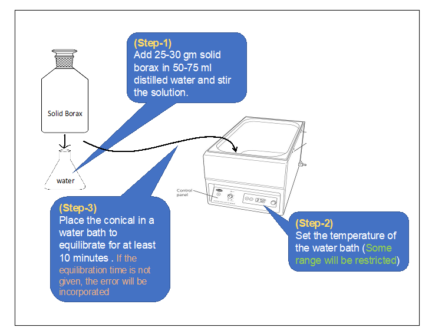
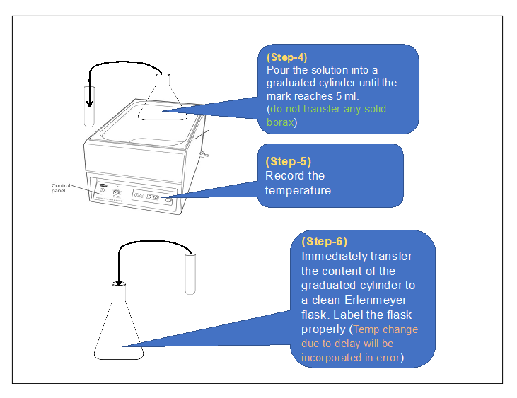
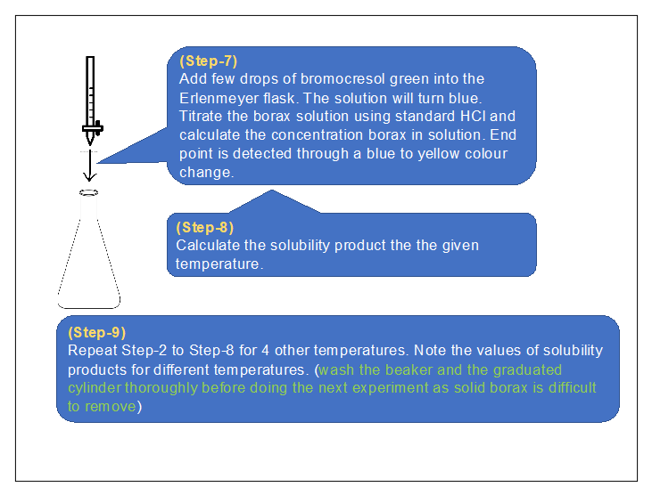
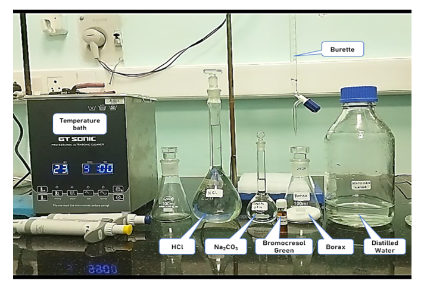
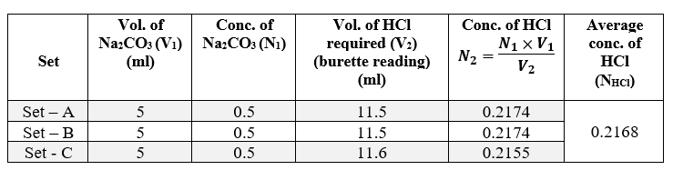
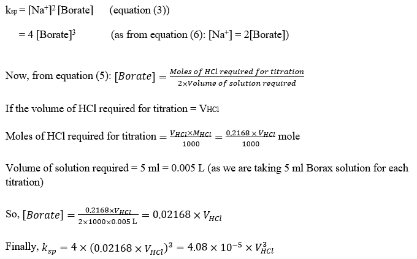
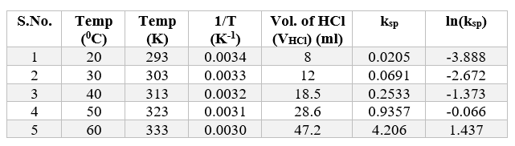
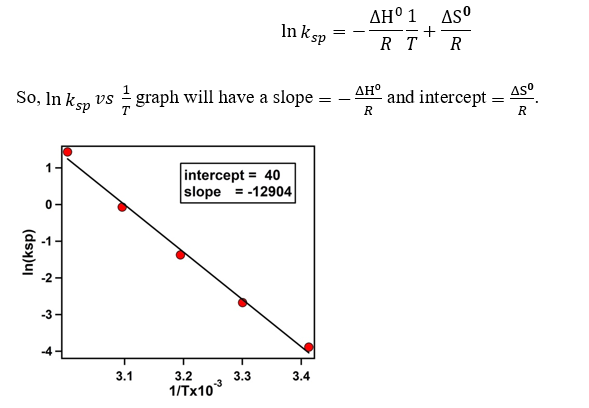
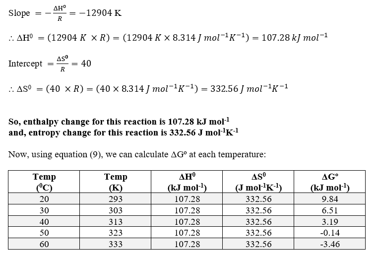

<b>1) Apparatus :</b> 
A.	Temperature controlled water bath. 
B.	Volumetric flask  
C.	Conical flask  
D.	Burette 
E.	Micropipette 
F.	Measuring cylinder  

<b>2) Procedure in laboratory (diagram) :</b> 
 
 
  

<b>3) Procedure in laboratory :</b> 
  

<b>4) Data and the analysis :</b>  

<b>4.1) Standardisation of HCl by Na2CO3 :</b> 
 
Therefore, the molarity of HCl (MHCl) = 0.2168 (M) [as, Normality ≡ Molarity for HCl]  

<b>4.2) Calculation of solubility product (ksp) of Borax :</b> 
 

We will use the formula written above to calculate ksp at five different temperatures. 
  

<b>4.3) Plotting ln(ksp) vs 1/T to calculate ΔHº and ΔSº :</b> 
  

<b>5) Analysis :</b> 
  

