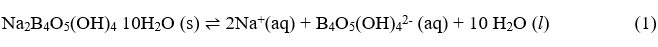
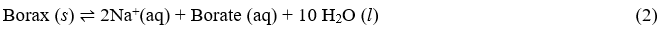
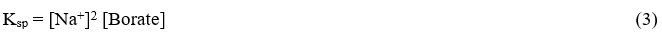
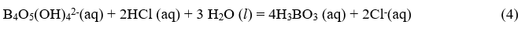
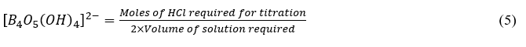
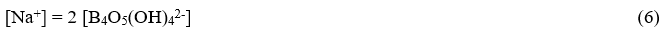
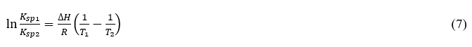
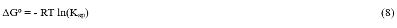
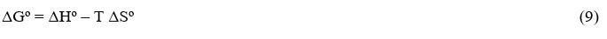

Borax is sparingly soluble in water. The equilibrium expression for the process that gives two sodium ions, one borate ion, B4O5(OH)4-2, and ten water molecules is:  

<!-- <b>Na2B4O5(OH)4 10H2O (s) ⇌ 2Na+(aq) + B4O5(OH)42-(aq) + 10 H2O (l)</b> .......... (1)   -->
 

The reaction can be written in simplified form as: 

<!-- <b>Borax(s) ⇌ 2Na+(aq) + Borate (aq) + 10 H2O (l)</b>	.......... (2)  -->
 

Since liquid water and solid borax are not included in the Ksp expression, the solubility product expression associated with this reaction is: 

<!-- <b>Ksp = [Na +]2 [Borate]</b>	.......... (3)   -->
 

The concentration of the borate ion in equilibrium will be determined by titration with standardized HCl according to the equation: 

<!-- <b>B4O5(OH)42-(aq) + 2HCl (aq) + 3 H2O (l) = 4H3BO3 (aq) + 2Cl-(aq)</b> .......... (4)   -->
 

According to equation (4), two moles of HCl are required for 1 mol of borate. Thus, 

<!-- <b>[B4O5(OH)42-]=(Moles of HCl required for titration)/(2×Volume of solution required)</b>  .......... (5)   -->
 

Also from the stoichiometric relationship in equation (1): 1 mole borate ≡ 2 mole Na+. Thus,  

<!-- <b>[Na+] = 2[B4O5(OH)42-]</b> .......... (6)   -->
 

Ksp of borax can be calculated from the values of [B4O5(OH)42-] and [Na+]. The Ksp for borax will be evaluated at room temperature (T1) and at about 278 K (T2). Ksp values at two temperatures allows the evaluation of the enthalpy change using Equation (7).  

 

Knowing the solubility product constant at two different temperatures also allows the evaluation of the Gibbs free energy change (ΔG°) at each of the two temperatures using Equation 8. 

 

Remember that ΔH and ΔS are not supposed to change with temperature. On the other hand, ΔG usually does change appreciably with temperature. Once ΔHº (same as ΔH) and ΔGº values are known for each temperature, the values of the entropy change, ΔSº, at each temperature can be evaluated using equation (9). 

 

